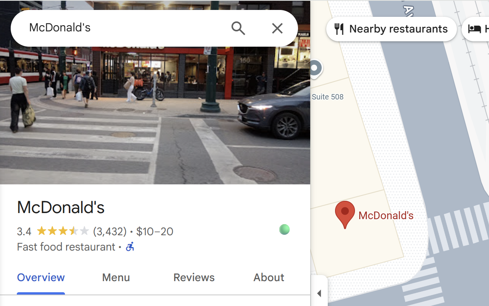

<div align="center">
    <h1>
        DineSafe Overlay
        <br clear="all" />
        
        <a href="https://github.com/AryanAb/health-inspector/actions"></a>
    </h1>
</div>

This is the repository for DineSafe Overlay — a browser extension to display Toronto's DineSafe information directly on Google Maps.



## Develop

Below are useful commands if you'd like to contribute to this repository, or fork it and work on yor own version.

```
# build the extension for debug purposes
npm run debug

# build the extension for production purposes
npm run build

# create a zip directory to be uploaded 
npm run release

# run playwright end-to-end tests
npm run e2e
```

Note that you need to build the extension each time you make a change and want to test it on the browser or with the end-to-end tests.
